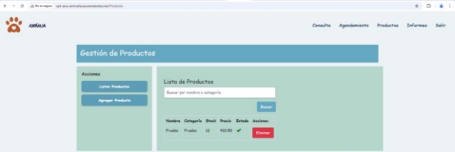

**Sistema de Gestión Veterinaria "Animalia" Tacna** 

**Estudiantes:** 

**Apellido y Nombre** Apaza Mamani, Edward Hernan CCalli Chata, Joel Robert 

1. **Antecedentes** 

El sistema de gestión veterinaria surge como una necesidad ante las deficiencias en el manejo de historiales clínicos, control de inventarios y administración de citas en clínicas veterinarias. La falta de digitalización y la gestión manual generan errores, retrasos y pérdida de información. Este proyecto busca optimizar la administración de las clínicas veterinarias mediante un software eficiente y automatizado. 

2. **Planteamiento del Problema** 
1. **Problema** 

Las clínicas veterinarias enfrentan dificultades en la organización de historiales médicos, control de productos y notificación de citas a clientes. La ausencia de un sistema centralizado dificulta la eficiencia operativa y el seguimiento adecuado de los pacientes. 

2. **Justificación** 

Implementar un sistema de gestión permitirá mejorar la calidad del servicio veterinario, reduciendo tiempos administrativos, evitando pérdida de información y optimizando la relación con los clientes. 

3. **Alcance** 

El sistema abarcará la gestión de historiales clínicos, administración de inventarios, control de citas, notificaciones automáticas por correo electrónico y generación de reportes en PDF. No incluirá telemedicina ni facturación electrónica en esta primera fase. 

3. **Objetivos** 

**Objetivo general** 

Desarrollar un sistema de gestión veterinaria que optimice la administración de clínicas veterinarias y mejore la experiencia del cliente. 

**Objetivos específicos** 

- Digitalizar los historiales clínicos de los pacientes. 
- Implementar un sistema de control de productos veterinarios. 
- Automatizar las notificaciones de citas y recordatorios. 
- Generar reportes en formato PDF para análisis de gestión. 
4. **Marco Teórico** 
- Conceptos y fundamentos de la gestión veterinaria. 
- Aplicaciones de tecnologías de la información en el ámbito veterinario. 
- Seguridad y normativas aplicadas al software de gestión clínica. 
5. **Desarrollo de la Solución** 
1. **Análisis de Factibilidad** 
- **Evaluación técnica:** Tecnologías y recursos disponibles. 
- **Evaluación económica:** Costos de desarrollo y mantenimiento. 
- **Evaluación operativa:** Beneficios y eficiencia operativa esperada. 
- **Evaluación social:** Impacto en la comunidad veterinaria. 
- **Evaluación legal:** Cumplimiento de normativas sobre datos clínicos. 
- **Evaluación ambiental:** Uso responsable de recursos digitales. 
2. **Tecnología de Desarrollo** 
- **Lenguajes de programación:** ASP.NET/SQL SERVER para backend. 
- **Base de datos:** SQL SERVER para almacenamiento de información. 
- **Infraestructura:** Implementación en la nube para accesibilidad y seguridad. 
3. **Metodología de Implementación** 
- Uso de metodologías ágiles (Scrum) para desarrollo iterativo. 
- Creación de documentos de **Visión**, **SRS** y **SAD** como referencia técnica. 
6. **Cronograma** 
- Planificación detallada de actividades mediante diagrama de Gantt. 
- Fases de análisis, diseño, desarrollo, pruebas e implementación. 

7. **Presupuesto** 

**Costos Generales** 

**Elemento** 
Infraestructura en la nube Licencias de software 
Equipos adicionales 

**Costo (S/.)** 0 

600 

1,200 

**Costos Operativos Durante el Desarrollo** 

**Elemento  Costo Mensual (S/.)** Servicios básicos  300 

Internet  150 

**Costos de Personal** 

**Rol** 

Desarrollador Backend 

Desarrollador Frontend 

**Cantidad** 1 

1 

**Salario 
Mensual (S/.)** 

1,200 1,200 

**Duración (Meses)** 

2 2 

**Costo Total (S/.)** 

2,400 2,400 

**Costos Totales** 

**Categoría** Costos Generales Costos Operativos Costos de Personal **Total** 

**Costo Total (S/.)** 2,600 

900 

4,800 

**8,300** 

8. **Conclusiones **
- Beneficios esperados en la administración de clínicas veterinarias. 
- Impacto positivo en la eficiencia y reducción de errores administrativos. 
- Potencial de escalabilidad y mejoras futuras. 
9. **Recomendaciones** 
- Sugerencias para la optimización del sistema a largo plazo. 
- Evaluación periódica de la funcionalidad y rendimiento. 
10. **Bibliografía** 
- Smith, J. (2020). *Veterinary Management Systems: A Digital Approach.* Springer. DOI: 10.1007/s00134-020-06134 
- Brown, L. & White, K. (2019). *Technological Advancements in Animal Healthcare.* Elsevier. DOI: 10.1016/j.vet.2019.05.012 
- World Health Organization (2021). *Digital Innovations in Veterinary Practice.* WHO Press. Available 

  at:[ https://www.who.int/publications/i/item/digital-vet-2021 ](https://www.who.int/publications/i/item/digital-vet-2021)

11. **Anexos** 

**Anexo 01 Factibilidad Económica Anexo 02 Visión **

**Anexo 03 – SRS** 

**Diagrama de Clases** 

**Diagrama de Base de Datos** 

**Diagrama de Arquitectura** 

**Diagrama de Componentes** 

**Diagrama de Actividades** 

**Diagrama de despliegue** 

**Diagrama de Infraestructura** 

**Infracost Report:** 

**Diagrama de Arquitectura:** 

Despliegue de Sistema en la Nube: 

Gestión de Productos: 

Notificaciones:  

